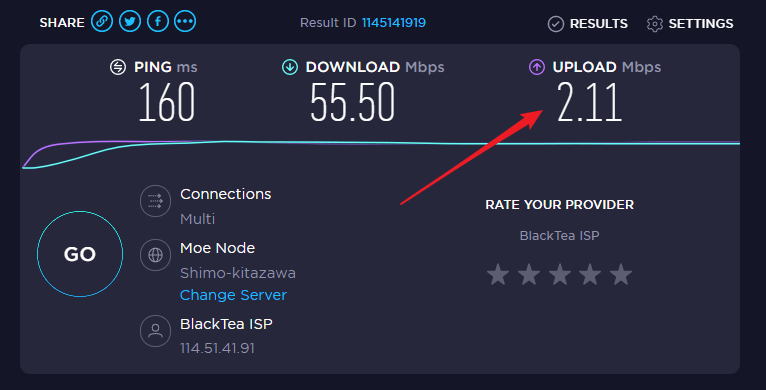

# 常见问题: 网路相关

## 为什么穿透速率无法到达标称的最大速率?

*   我们的限速单位为 Mbps, 即 **Megabits per second**

    单位换算公式为 `1 Mbps = 0.125 MB/s` ，如您的限速为`5Mbps 上行 / 5 Mpbs 下行` ，则您实际可以得到的速率为 `0.625 MB/s`.
*   速率还受限于您 **运行Frpc的电脑**的**上行带宽**

    您可以使用那个设备访问 我们认可的[测速网站](https://speedtest.net/), 点击 `GO` 进行网速测试

    Tips: _节点选择时通常较慢,请耐心等待_

    例如，在下面这张截图中，上行带宽只有`2.11 Mbps`，也就是说，即使我们限速`5Mbps`您实际上也只能获得 `2.11 Mbps = 0.26375 MB/s=262.5 kB/s` 的最大的下载速度

节点带宽为所有用户共享，因此负载过高时您将无法获得到标称带宽

例如，节点标称带宽为 `100 M`，假如有 5 个限速为 `36 Mibps` 的用户同时通过这个节点下载文件，那么可能这 5 个人都只能获取到 `20 Mibps = 2.5 MiB/s` 的下载速度。当然，由于各个用户的网络质量不同，可能有的用户能获得 `36 Mibps = 4.5 MiB/s` 的下载速度，有的用户只有几百 KiB/s 的速度。

您可以在[状态监控页面](https://openfrpstatus.zyghit.cn/)查看节点负载，负载越高，您所获得的体验越差，反之亦然

_本段来自Sakura Frp帮助文档_

## 敬告 

Minecraft 对节点性能影响极为严重，我们 **非常不推荐** 您使用 OpenFrp 的服务穿透 Minecraft服务器

由于穿透 Minecraft 的用户过多，大部分免费节点的网卡 PPS 都远超出正常值。PPS 达到上限后，即使节点带宽只用了一半，剩下的一半带宽也无法被利用，相当于直接浪费了。

_来自 Sakura Frp 帮助文档_

## 节点有IPV6支持吗 

**没有！**我们所有的节点均不支持使用IPv6进行链接，我们也不会考虑提供IPv6的支持

~~有公网IPv6为何还需要内网穿透呢?~~

（我补充一下 你有公网v6不一定对面有公网v6 PS 有一些用户有v6 需要申请才有公网)

## 管理面板打不开的怎么办 

* 这通常是由于各种神秘的网络问题造成的，也可能是我们的服务器遭到了严重的网络攻击，你可以尝试以下办法
* 更换设备访问 (如手机更换为电脑)
* 更换网络环境访问 (如 WiFi 更换为 4G、5G 网络)
* 更换浏览器访问 (推荐使用 Google Chrome / Microsoft Edge / Firefox)
* 查看[状态监控页面](https://openfrpstatus.zyghit.cn/)中 `#0 OpenFrp - 主站` 是否正常
* 查看在 [OpenFrp 用户交流群](https://jq.qq.com/?\_wv=1027\&k=KaX522RH) 中是否有故障通知

## 使用 UDP 的游戏无法通过内网穿透访问 

*   部分使用 UDP 协议传输数据的游戏服务端要求远程端口与本地配置的端口一致才能正常进行通信。

    如果使用 UDP 隧道的游戏正常无法连接，请尝试修改游戏服务器配置文件中的 `监听端口`，使其与隧道的 `远程端口` 一致。

    别忘了编辑隧道把 `本地端口` 也改成同样的值
